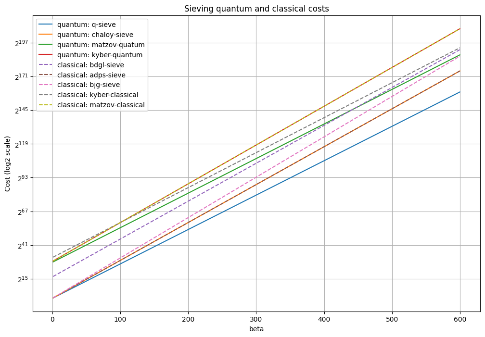
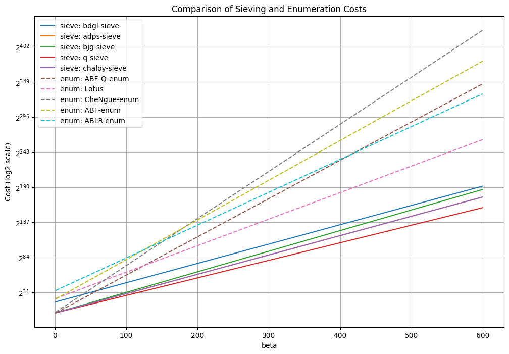

# Cost Models

Given the simplified cost for BKZ behaviour that we consider $cost = \tau \cdot d \cdot T_{SVP}$, we still need to define the cost of the SVP solver. Sieving and enumeration are the two common strategies to find the shortest non-zero vector in a lattice.

## Sieving

Sieving algorithms for SVP work by iteratively refining a large set of lattice vectors to obtain progressively shorter vectors until the shortest one is found. In its basic form, the sieving process starts by generating a large set of random lattice vectors, often called a "cloud." Pairs of vectors are then combined (usually by adding or subtracting them) to produce shorter vectors, which are then added back to the cloud if they meet certain criteria. This process continues until the vectors in the cloud converge towards the shortest lattice vector. Modern sieving methods, like the GaussSieve or ListSieve, have been optimized to handle higher-dimensional lattices by limiting pairwise vector interactions, which reduces computational complexity. Sieving requires storing a large number of lattice vectors and, therefore, can be memory-intensive, especially as the lattice dimension grows.

In terms of cost, sieving algorithm can solve the SVP in a lattice of dimension d in $2^{O(k)}$ time but at the cost og a much higher memory usage. At the risk of being overly conservative, our estimator will disregard memory usage.

The following sieving estimates are available:

| Name      | Reference | Cost | Regime |
| ----------- | ----------- | ----------- | ----------- |
| BDGL-sieve      | todo       | $2^{0.292\beta + 16.4}$ big $\beta$ $2^{0.387\beta + 16.4}$ small $\beta$|  classical       |
| Q-sieve      | todo       | $2^{0.265\beta}$      |  quantum       |
| ADPS-sieve   | tedo        | $2^{0.292\beta}$| classical       | t2       |
| BJG-sieve   | todo        | $2^{0.311\beta}$       | classical       |
| ChaLoy-sieve   | todo        | $2^{0.257\beta}$       | quantum       |

Here are some plots to better visualize sieving costs.

## Enumeration 

Enumeration algorithms systematically search through lattice points in a controlled way, typically by traversing lattice vectors within a fixed radius from the origin. They rely on a recursive process to explore potential candidate vectors within a "search region," using techniques to prune paths that are unlikely to lead to the shortest vector. Enumeration is typically carried out with the help of a basis that has been reduced (made close to orthogonal), as this greatly improves efficiency by minimizing the number of candidate paths. Unlike sieving, enumeration methods are deterministic and guarantee finding the shortest vector by systematically exploring all feasible paths. The efficiency of enumeration depends strongly on the quality of the lattice basis. Preprocessing steps like BKZ (Block Korkine-Zolotarev) reduction can make enumeration significantly faster by transforming the basis to be more suitable for search. Enumeration is often practical for lower-dimensional lattices or when a high degree of accuracy is needed, but it tends to be less efficient than sieving in high dimensions due to its exponential complexity.

In terms of cost, enumeration can solve SVP in a lattice of dimension d in $2^{O(k \log k)}$ time and space.

The following enumeration estimates are available:

| Name      | Reference | Cost | Regime |
| ----------- | ----------- | ----------- | ----------- |
| Lotus      | todo       | $2^{0.125\beta\log\beta -0.755\beta + 22.74}$ |  classical       |
| CheNgue-enum      | todo       | $2^{0.27\beta\log\beta -1.019\beta + 2.254}$ |  classical       |
| ABF-enum   | todo        | $2^{0.184\beta\log\beta - 0.995\beta + 22.25}$ small $\beta$ $2^{0.125\beta\log\beta-0.547\beta+16.4}$ big $\beta$    | classical       | t2       |
| ABF-Q-enum   | todo        | $2^{0.0625\beta\log\beta}$       | quantum       |
| ABLR-enum   | todo        | $2^{0.184\beta\log\beta - 1.077\beta + 35.12}$ small $\beta$ $2^{0.125\beta\log\beta-0.655\beta+31.84}$ big $\beta$    | classical       |

Here are some plots to better visualize enumeration costs.

### Method comparison

We can see that sieving performs better overall when the dimension of the SVP problem get big, which is the expected behavior. For this reason, we encourage making security estimates with sieving as an underlying SVP solver.
