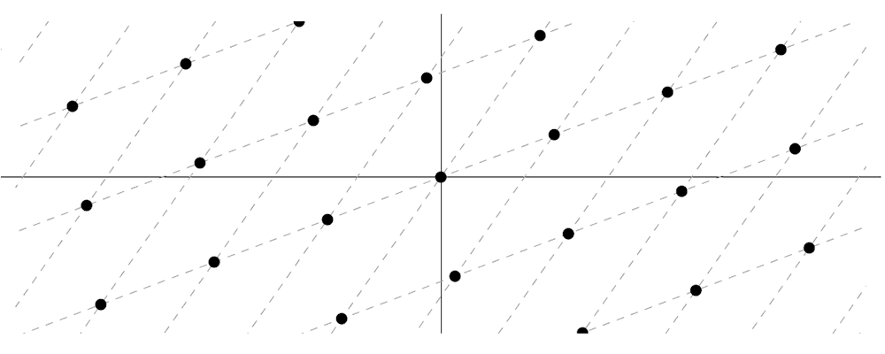

# Preliminaries

## Lattices

A *lattice* is defined as a set of points in n-dimensional space with a periodic structure. A lattice can be represented by a set of linearly independent vectors commonly named the basis of the lattice. If \\(\bold{b_1}, ..., \bold{b_n}\\) denote basis vectors we can describe a lattice by: $$\Lambda(\bold{b_1}, ..., \bold{b_n}) = \{\sum_{i=1}^{n}x_i\bold{b_i}: x_i \in \mathbb{Z}\}$$

In the rest of this work, we will especially consider q-ary lattices described by a basis \\(\bold{B} \in \mathbb{Z}^{h\times w}_q\\), in which coefficients are taken modulo q. 

### The Short Vector Problem

The security of lattice based constructions rely on the fact that finding the shortest non-zero vector in a lattice is a hard problem. One usually considers an approximation version of the SVP problem. Given a basis \\(\bold{B}\\) of a lattice, *the approximate SVP problem* is the problem of finding a short lattice vector \\(\bold{v}\\) such that \\(0 < \lVert \bold{v} \rVert \leq \gamma\lambda_1(\Lambda(\bold{B}))\\) where \\(\lambda_1\\) denotes the shortest nonzero vector length and \\(\gamma\\) is the approximation factor.

It is actually believed that no polynomial time algorithm can approximate such a lattice problem within polynomial factors. Furthermore, it is also believed that no polynomial time quantum algorithm can approximate such a lattice problem within polynomial factors.

### Lattice reduction algorithms

*Lattice reduction algorithms* aim to transform a given basis of a lattice into a "reduced" basis, where the vectors are shorter and closer to being orthogonal. This reduction makes it easier to approximate solutions to hard lattice problems like the Shortest Vector Problem. In short, the quality of a basis can be improved to make the problem easier. The most prominent lattice reduction algorithms include:

 - **LLL Algorithm (Lenstra–Lenstra–Lovász)**: it produces a reduced basis in polynomial time, where the vectors are guaranteed to be within a known factor of the shortest vector, but doesn’t necessarily find the shortest vector,
 - **BKZ Algorithm (Block Korkine-Zolotarev)**: the BKZ algorithm is a generalization of the LLL algorithm and provides better reduction at the cost of higher computational complexity. By working in blocks of the lattice and applying LLL reduction to these blocks, BKZ achieves stronger approximations of the shortest vector, though it requires more computational resources.
 - **Sieving and Enumeration**: algorithms that are designed to give exact solutions to the SVP problem.

## Security

The foundational belief of security in new lattice-based primitives stems from one key finding. Ajtai’s theorem connected the hardness of certain average-case problems to the difficulty of worst-case problems in lattices. Specifically, Ajtai demonstrated that for the Short Integer Solution (SIS) problem which we will define later, the average-case instances are at least as hard as the worst-case instances of the Shortest Vector Problem (SVP) on lattices. This means that if one could efficiently solve random instances of SIS, then they could also solve the worst-case SVP, a problem believed to be intractable even for quantum computers. Ajtai’s theorem provides a strong security guarantee for lattice-based cryptographic schemes by grounding their security in the hardness of well-studied lattice problems like SVP.